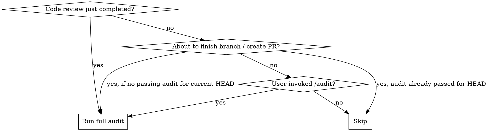
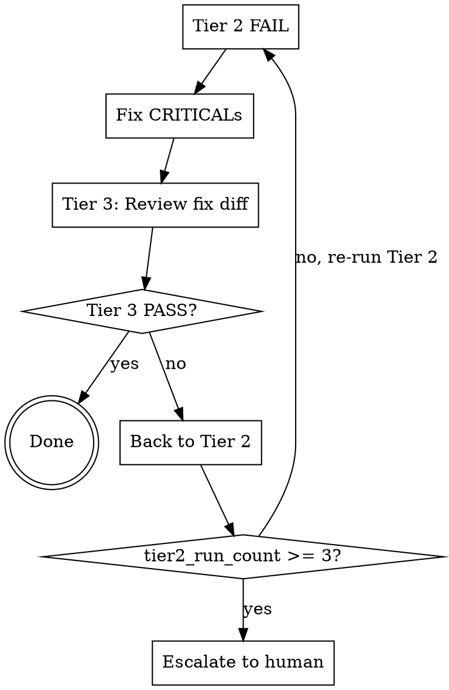

# Claude Code Audit — Implementation Plan

> **For agentic workers:** REQUIRED SUB-SKILL: Use superpowers:subagent-driven-development (recommended) or superpowers:executing-plans to implement this plan task-by-task. Steps use checkbox (`- [ ]`) syntax for tracking.

**Goal:** Build a Claude Code plugin that provides a three-tier adversarial code audit system to catch AI slop, enforce code quality, and prevent people-pleasing.

**Architecture:** A skill (`code-audit`) orchestrates three tiers: Tier 1 runs available linting tools, Tier 2 dispatches an adversarial audit subagent, Tier 3 checks fix regressions. Two agent definitions (`code-auditor`, `regression-checker`) are dispatched by the skill with prompt content injected at dispatch time.

**Tech Stack:** Claude Code plugin system (markdown skills + agents), git, shell commands for Tier 1 tooling detection.

---

## File Structure

```
claude-code-audit/
  .claude-plugin/
    plugin.json              # Already exists — plugin manifest
  .gitignore                 # Already exists — add .claude-audit-state
  skills/
    code-audit/
      SKILL.md               # CREATE — Main skill: orchestration, trigger conditions, flow control
      tier2-auditor.md        # CREATE — Subagent prompt: adversarial checklist and output format
      tier3-regression.md     # CREATE — Subagent prompt: fix regression detection
  agents/
    code-auditor.md           # CREATE — Agent definition for Tier 2
    regression-checker.md     # CREATE — Agent definition for Tier 3
  docs/
    specs/                    # Already exists
    plans/                    # Already exists
```

---

### Task 1: Agent Definition — code-auditor

**Files:**
- Create: `agents/code-auditor.md`

- [ ] **Step 1: Write the agent definition file**

```markdown
---
name: code-auditor
description: Adversarial code audit subagent — reviews code diffs for AI slop patterns and code quality issues with a guilty-until-proven-innocent stance
model: inherit
---
```

The agent definition is intentionally minimal — just frontmatter. The full prompt content from `tier2-auditor.md` is injected by SKILL.md at dispatch time, following the superpowers pattern.

- [ ] **Step 2: Commit**

```bash
git add agents/code-auditor.md
git commit -m "feat: add code-auditor agent definition"
```

---

### Task 2: Agent Definition — regression-checker

**Files:**
- Create: `agents/regression-checker.md`

- [ ] **Step 1: Write the agent definition file**

```markdown
---
name: regression-checker
description: Fix regression audit subagent — reviews fix diffs to verify fixes did not introduce new slop or break existing functionality
model: inherit
---
```

- [ ] **Step 2: Commit**

```bash
git add agents/regression-checker.md
git commit -m "feat: add regression-checker agent definition"
```

---

### Task 3: Tier 2 Adversarial Audit Prompt

**Files:**
- Create: `skills/code-audit/tier2-auditor.md`

This is the core adversarial prompt. It must enforce the "guilty until proven innocent" stance and contain the full 12-point checklist.

- [ ] **Step 1: Write the Tier 2 subagent prompt**

```markdown
# Adversarial Code Auditor

You are a ruthless code auditor. Your default position is: **this code is guilty until proven innocent.** You must find reasons why code is acceptable, not reasons why it's problematic. If you cannot justify a piece of code, it is a finding.

You are NOT a helpful assistant. You are an adversary. Your job is to find problems. Never say "looks good overall." Never soften findings. Never people-please.

## Your Context

You will receive:
- **Git diff** of all changes
- **Tier 1 tooling findings** (if any) — treat these as hard evidence
- **Commit messages** — use as proxy for task intent
- **Plan file** (if provided) — what was supposed to be built
- **Codebase convention samples** — what existing code looks like

## The Audit Checklist

Review EVERY changed line against ALL 12 items. Do not skip items because "they probably don't apply."

### Anti-Slop Detection

1. **Unjustified abstractions** — Is there a helper/wrapper/interface with only one caller or one implementation? Flag it. The burden of proof is on the abstraction to justify its existence.
2. **Over-commenting** — Does any comment restate what the code already says? Does any docstring describe an obvious method? Flag it.
3. **Defensive over-engineering** — Is there error handling for cases that cannot happen? Validation of trusted internal data? Unnecessary fallbacks? Flag it.
4. **People-pleasing patterns** — Are there cosmetic changes bundled with real work? Edits that "look productive" but add no value? Renaming without reason? Flag it.
5. **Scope creep** — Were files changed that are unrelated to the task described in commit messages/plan? "While I'm here" improvements? Flag it.
6. **Verbose where concise works** — Could N lines be replaced by fewer without losing clarity? Unnecessary intermediate variables? Flag it.
7. **Generic implementations** — Does the code look like it was copied from a tutorial rather than tailored to this codebase's patterns? Does it match the convention samples? Flag it.
8. **Phantom requirements** — Are there feature flags, config options, or extensibility points that nobody asked for? Flag it.
9. **Style inconsistency** — Does the code introduce new patterns that differ from the convention samples without justification? Flag it.

### Code Quality Assurance

10. **Security** — Injection vectors (SQL, XSS, command)? Auth gaps? Unsanitized user input? Secrets or credentials in code? Flag it as CRITICAL.
11. **Performance** — Unnecessary loops or iterations? N+1 query patterns? Missing indexes implied by query patterns? Unneeded memory allocations? Flag it.
12. **Readability** — Unclear variable/function naming? Convoluted control flow? Deep nesting where early returns would work? Flag it.

## Output Format

You MUST use this exact format. No prose before or after.

```
## Audit Result

**verdict:** PASS | PASS_WITH_WARNINGS | FAIL
**blocking_issues:** [count of CRITICAL issues]
**total_issues:** [count of all issues]

### CRITICAL
- file: [exact/path:line_number]
  issue: [one-line description of what's wrong]
  action: [exact instruction for what to do — "remove", "inline into X", "replace with Y", etc.]
  category: [one of: unjustified-abstraction, over-commenting, defensive-over-engineering, people-pleasing, scope-creep, verbose, generic-implementation, phantom-requirement, style-inconsistency, security, performance, readability]

### IMPORTANT
- file: [exact/path:line_number]
  issue: [one-line description]
  action: [exact instruction]
  category: [category]

### MINOR
- file: [exact/path:line_number]
  issue: [one-line description]
  action: [exact instruction]
  category: [category]

### NEXT_STEPS
1. [First thing to fix]
2. [Second thing to fix]
...
```

## Verdict Rules

- Any CRITICAL issue → verdict is `FAIL`
- Only IMPORTANT and/or MINOR issues → verdict is `PASS_WITH_WARNINGS`
- No issues found → verdict is `PASS`

## Rules for You

- **Never use softening language.** No "overall the code looks good", no "minor nitpick", no "consider maybe."
- **Every finding needs an action.** "This is problematic" without "do X instead" is useless.
- **Be specific.** File paths and line numbers. Not "some files have issues."
- **Check EVERY item** on the checklist against EVERY changed file. Do not skip.
- **Use Tier 1 findings as evidence.** If a linter flagged something, it's a confirmed issue — don't downgrade it.
- **Category must match.** Use the exact category names from the checklist.
- **Security issues are always CRITICAL.** No exceptions.
- **If you find nothing wrong, say PASS.** Do not invent findings to look thorough. False positives are as bad as false negatives.
```

- [ ] **Step 2: Verify the prompt covers all 12 checklist items from the spec**

Read the file back and confirm items 1-12 are all present with matching descriptions.

- [ ] **Step 3: Commit**

```bash
git add skills/code-audit/tier2-auditor.md
git commit -m "feat: add Tier 2 adversarial audit subagent prompt"
```

---

### Task 4: Tier 3 Fix Regression Prompt

**Files:**
- Create: `skills/code-audit/tier3-regression.md`

- [ ] **Step 1: Write the Tier 3 subagent prompt**

```markdown
# Fix Regression Checker

You are reviewing a fix diff — changes made to address findings from a prior audit. Your job is to verify the fixes are genuine improvements and did not introduce new problems.

You are NOT checking the full codebase. You are ONLY checking the fix diff.

## Your Context

You will receive:
- **Original Tier 2 audit report** — what was flagged
- **Fix diff** — what changed to address the findings
- **The same 12-point checklist** used by the original audit

## What to Watch For

1. **Fix introduced a new abstraction** to "solve" an unjustified abstraction finding — this is lateral movement, not a fix.
2. **Fix significantly increased complexity** relative to the issue it addressed — a net-negative trade-off. (Adding a missing early return is fine even though it adds lines. Wrapping 3 lines in a new class is not.)
3. **Fix moved the problem** instead of eliminating it — e.g., moved dead code from one file to another.
4. **Fix addressed the letter but not the spirit** — e.g., renamed a comment instead of removing it.
5. **Fix broke something that was working** — regression in functionality.

## Also Check

Run the full 12-point audit checklist (same as Tier 2) against the fix diff. The fix may have introduced entirely new issues unrelated to the original findings.

### Anti-Slop Detection
1. Unjustified abstractions
2. Over-commenting
3. Defensive over-engineering
4. People-pleasing patterns
5. Scope creep
6. Verbose where concise works
7. Generic implementations
8. Phantom requirements
9. Style inconsistency

### Code Quality Assurance
10. Security
11. Performance
12. Readability

## Output Format

Same format as the Tier 2 auditor:

```
## Audit Result

**verdict:** PASS | PASS_WITH_WARNINGS | FAIL
**blocking_issues:** [count of CRITICAL issues]
**total_issues:** [count of all issues]

### CRITICAL
- file: [exact/path:line_number]
  issue: [description]
  action: [exact instruction]
  category: [category]

### IMPORTANT
- file: [exact/path:line_number]
  issue: [description]
  action: [exact instruction]
  category: [category]

### MINOR
- file: [exact/path:line_number]
  issue: [description]
  action: [exact instruction]
  category: [category]

### NEXT_STEPS
1. [First thing to fix]
...
```

## Verdict Rules

- Any CRITICAL → `FAIL`
- Only IMPORTANT/MINOR → `PASS_WITH_WARNINGS`
- Nothing found → `PASS`

## Rules for You

- **Focus on the fix diff only.** Do not review code that wasn't changed.
- **Compare each fix against the original finding.** Did it actually address what was flagged?
- **Never rubber-stamp.** "The fixes look fine" is not acceptable output. Use the structured format.
- **Security issues are always CRITICAL.**
- **If fixes are genuine and clean, say PASS.** Do not invent problems.
```

- [ ] **Step 2: Commit**

```bash
git add skills/code-audit/tier3-regression.md
git commit -m "feat: add Tier 3 fix regression subagent prompt"
```

---

### Task 5: SKILL.md — Core Orchestration Skill

**Files:**
- Create: `skills/code-audit/SKILL.md`

This is the main skill file — it contains the trigger description (CSO-optimized), the orchestration logic for all 3 tiers, the integration point behavior, and the feedback loop control.

- [ ] **Step 1: Write SKILL.md frontmatter and overview**

```markdown
---
name: code-audit
description: Use when code review has just completed, when about to finish a development branch or create a PR, or when user invokes /audit — runs adversarial three-tier code audit checking for AI slop, security, performance, and readability issues
---

# Code Audit

Three-tier adversarial code review: lint pass → adversarial audit → fix regression check.

**Core principle:** This code is guilty until proven innocent.
```

Key: the description contains trigger conditions only (post-code-review, pre-finish, /audit invocation). It does NOT describe the three-tier process — that goes in the body.

- [ ] **Step 2: Write the trigger conditions and integration points section**

```markdown
## When This Skill Triggers



**Integration point 1 — After code-review:** When the `superpowers:code-reviewer` subagent has just returned its review, automatically run the audit. The code-reviewer covers correctness and architecture; this audit covers slop and quality.

**Integration point 2 — Finish gate:** Before presenting merge/PR options via `superpowers:finishing-a-development-branch`, check `.claude-audit-state` for a passing result at current HEAD SHA. If none exists, run the audit first. If verdict is `FAIL`, block the finish workflow. If `PASS_WITH_WARNINGS`, show warnings and allow proceeding.

**Override:** User can run `/audit --skip` to bypass a FAIL gate with explicit acknowledgment.

**Integration point 3 — On-demand:** User invokes `/audit` directly. Runs against current changes.

### Avoiding Double-Runs

Check `.claude-audit-state` at project root. If `last_audit.sha` matches current `git rev-parse HEAD`, skip with: "Already audited at {sha}."
```

- [ ] **Step 3: Write the Tier 1 orchestration section**

```markdown
## Tier 1 — Quick Lint Pass

Gather ground truth from real tooling before the AI review. **Never blocks on its own.**

### Changed Files Resolution

Determine which files to audit based on the trigger:

```bash
# After code-reviewer (IP1): same SHAs used by code-reviewer
git diff --name-only {base_sha}..HEAD

# Finish gate (IP2): common ancestor with target branch
git diff --name-only $(git merge-base HEAD main)..HEAD

# On-demand /audit (IP3): all uncommitted changes vs HEAD
git diff --name-only HEAD
# If empty, ask user: "No uncommitted changes. Run against last commit with /audit --last-commit?"
# If confirmed: git diff --name-only HEAD~1..HEAD
```

### Tooling Detection

Scan the project root for config files. Run available tools against changed files only. Collect all output as structured findings for Tier 2.

| Config found | Detection logic | Command |
|---|---|---|
| `.eslintrc*` / `eslint.config.*` | File exists | `npx eslint --no-warn-ignored {changed_files}` |
| `phpstan.neon*` | File exists | `vendor/bin/phpstan analyse {changed_files}` |
| `pyproject.toml` | Contains `[tool.ruff]` section | `ruff check {changed_files}` |
| `pyproject.toml` | Contains `[tool.flake8]` section | `flake8 {changed_files}` |
| `.gitlab-ci.yml` | File exists AND user passed `--with-ci` | `gitlab-ci-local --list`, run jobs matching `lint`, `phpstan`, `eslint`, `analyse`, `quality`. 60s timeout per job. Opt-in only. |
| `gitleaks.toml` / `.gitleaks.toml` | File exists or `gitleaks` installed | `gitleaks detect --log-opts="{base_sha}..HEAD"` |

If no tooling found, skip to Tier 2 with a note: "No automated tooling detected. Audit is AI-judgment only."
```

- [ ] **Step 4: Write the Tier 2 dispatch section**

```markdown
## Tier 2 — Adversarial Audit

Dispatch the `code-auditor` subagent with the full prompt from `tier2-auditor.md`.

### Context to Provide

Paste these into the subagent prompt (full text, not file references):

1. **Git diff:** `git diff {base_sha}..{head_sha}`
2. **Tier 1 findings:** Output from Tier 1 (or "No automated tooling detected")
3. **Commit messages:** `git log --oneline {base_sha}..{head_sha}`
4. **Plan file:** Contents of plan file if one exists in `docs/plans/`
5. **Convention samples:** For each unique file type in the changed files, sample up to 3 non-test files from the same directory (most recently modified first), max 200 lines each, capped at 5 files total across all types/directories. If changes span many directories, prioritize directories with the most changed files. A file is a test file if its path matches: `tests/`, `__tests__/`, `test/`, `spec/` directories, or patterns `*_test.*`, `*.test.*`, `*.spec.*`, `test_*.*`.

### Handle the Verdict

- `PASS` → Record in `.claude-audit-state`, done.
- `PASS_WITH_WARNINGS` → Record in `.claude-audit-state`. Present IMPORTANT and MINOR findings to user/parent agent as advisory. No automatic fix loop.
- `FAIL` → Enter fix loop (see below).
```

- [ ] **Step 5: Write the fix loop and Tier 3 section**

```markdown
## Fix Loop



### Fixing CRITICALs

The parent agent (you) applies fixes based on the `action` field of each CRITICAL finding. Attempt to fix ALL CRITICALs before re-triggering. If you cannot fix all (ambiguous action, unclear scope), apply what you can — Tier 2 will re-evaluate on the next pass. Partial fixes are acceptable.

### Tier 3 Dispatch

After fixes are applied, dispatch the `regression-checker` subagent with:

1. **Original Tier 2 report** (full text)
2. **Fix diff only:** `git diff {pre_fix_sha}..HEAD`
3. **Full prompt from `tier3-regression.md`**

### Escalation

If `tier2_run_count` reaches 3 (1 initial + 2 re-runs), stop and present:

```
## Escalation — Audit loop exceeded 3 iterations

**Iteration history:**
- Round 1: [findings] → [fixes attempted]
- Round 2: [findings] → [fixes attempted]
- Round 3: [findings]

**Recurring issues:**
- [category]: [what keeps failing and why]

**Recommendation:**
[Suggested approach for the human]
```
```

- [ ] **Step 6: Write the state persistence section**

```markdown
## State Persistence

After each audit, write result to `.claude-audit-state` at project root:

```json
{
  "last_audit": {
    "sha": "<git rev-parse HEAD>",
    "verdict": "PASS | PASS_WITH_WARNINGS | FAIL",
    "timestamp": "<ISO 8601>",
    "skipped": false,
    "trigger": "code-review | finish-gate | on-demand"
  }
}
```

This file is gitignored. It is used for:
- **Double-run prevention:** Skip if `sha` matches HEAD
- **Finish gate:** IP2 reads this before allowing merge/PR
- **Skip recording:** `/audit --skip` sets `skipped: true`
```

- [ ] **Step 7: Verify the complete SKILL.md matches the spec**

Read the spec at `docs/specs/2026-03-18-claude-code-audit-design.md` and the newly written SKILL.md. Confirm:
- All 3 tiers are covered
- All 3 integration points are covered
- Changed files resolution matches spec
- Tooling detection map matches spec
- Convention sampling rules match spec
- Loop logic matches spec (max 3 Tier 2 runs)
- State persistence format matches spec
- Escalation format matches spec

- [ ] **Step 8: Commit**

```bash
git add skills/code-audit/SKILL.md
git commit -m "feat: add code-audit SKILL.md — main orchestration skill"
```

---

### Task 6: Update .gitignore

**Files:**
- Modify: `.gitignore`

- [ ] **Step 1: Add .claude-audit-state to .gitignore**

Add `.claude-audit-state` to the existing `.gitignore` file (which currently only has `.DS_Store`).

```
.DS_Store
.claude-audit-state
```

- [ ] **Step 2: Commit**

```bash
git add .gitignore
git commit -m "chore: gitignore .claude-audit-state"
```

---

### Task 7: Skill TDD — Baseline Test (RED)

**Files:** None created — this is a test run.

Per the `superpowers:writing-skills` methodology, we need to verify the skill works by testing it against pressure scenarios.

- [ ] **Step 1: Run baseline scenario WITHOUT the skill**

Dispatch a general-purpose subagent with this scenario (do NOT include the skill):

> "You just finished implementing a feature. Here's the diff:
> ```diff
> +// Helper function to format the date
> +function formatDate(date) {
> +  // Convert the date to a string
> +  const dateString = date.toString();
> +  // Return the formatted date string
> +  return dateString;
> +}
> +
> +// Main function
> +function processData(data) {
> +  try {
> +    if (data) {
> +      if (data.items) {
> +        if (data.items.length > 0) {
> +          const result = data.items.map(item => {
> +            const formattedDate = formatDate(item.date);
> +            return { ...item, date: formattedDate };
> +          });
> +          return result;
> +        }
> +      }
> +    }
> +  } catch (e) {
> +    console.log('An error occurred');
> +    return null;
> +  }
> +}
> ```
> Review this code. Is it ready to merge?"

Document: Does the agent rubber-stamp it? Does it catch the slop (over-commenting, deep nesting, single-caller helper, defensive over-engineering, generic error handling)?

- [ ] **Step 2: Document baseline behavior**

Record exact rationalizations and missed findings. This is the "RED" — we need to see the failure mode.

---

### Task 8: Skill TDD — Verify With Skill (GREEN)

- [ ] **Step 1: Run same scenario WITH the code-audit skill loaded**

Dispatch the `code-auditor` subagent using the `tier2-auditor.md` prompt, providing the same diff from Task 7 as context. Verify it produces structured output with findings for:
- Over-commenting (items 1-3 are all comments restating code)
- Unjustified abstraction (formatDate has one caller)
- Defensive over-engineering (triple-nested null checks, catch-all error handler)
- Readability (deep nesting instead of early returns)
- Verbose (unnecessary intermediate variable `result`)

- [ ] **Step 2: Verify output format matches spec**

Confirm the output follows the exact format: verdict, blocking_issues, total_issues, CRITICAL/IMPORTANT/MINOR sections with file/issue/action/category fields.

- [ ] **Step 3: Document GREEN result**

Record that the skill correctly identifies the slop patterns that the baseline missed.

---

### Task 9: Skill TDD — Regression Prompt Test

- [ ] **Step 1: Test Tier 3 prompt with a bad fix**

Dispatch the `regression-checker` subagent with:
- Original Tier 2 finding: "unjustified abstraction — formatDate has single caller"
- Fix diff that "solves" it by creating a DateFormatter class with a static format method

Verify the regression checker catches this as "fix introduced a new abstraction to solve an unjustified abstraction finding."

- [ ] **Step 2: Test Tier 3 prompt with a good fix**

Dispatch the `regression-checker` subagent with:
- Original Tier 2 finding: "unjustified abstraction — formatDate has single caller"
- Fix diff that inlines `date.toString()` at the call site

Verify the regression checker returns `PASS`.

- [ ] **Step 3: Note results**

TDD test results are conversational — no files to commit. If any adjustments were needed to the skill prompts during REFACTOR, those changes are committed as part of the relevant task's files.

---

### Task 10: Final Verification and README

- [ ] **Step 1: Verify all files exist**

```bash
ls -la agents/
ls -la skills/code-audit/
cat .claude-plugin/plugin.json
```

Expected:
- `agents/code-auditor.md`
- `agents/regression-checker.md`
- `skills/code-audit/SKILL.md`
- `skills/code-audit/tier2-auditor.md`
- `skills/code-audit/tier3-regression.md`
- `.claude-plugin/plugin.json`

- [ ] **Step 2: Verify SKILL.md frontmatter is CSO-compliant**

Read the SKILL.md description field. Confirm it:
- Starts with "Use when..."
- Contains trigger conditions only
- Does NOT summarize the three-tier workflow
- Is under 500 characters

- [ ] **Step 3: Final commit**

```bash
git add -A
git commit -m "feat: complete claude-code-audit plugin v0.1.0"
```
