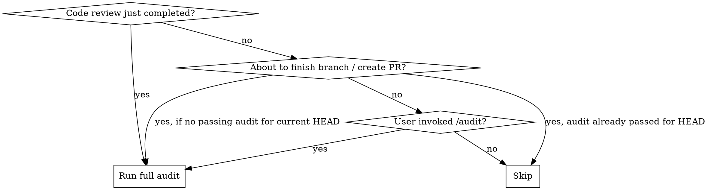
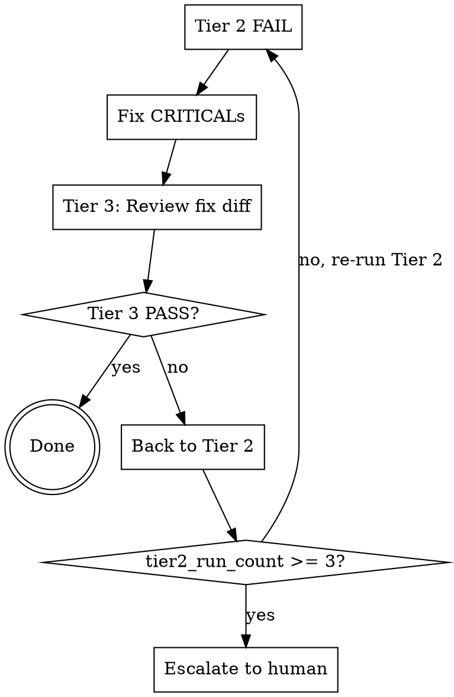

# Code Audit

Three-tier adversarial code review: lint pass → adversarial audit → fix regression check.

**Core principle:** This code is guilty until proven innocent.

## When This Skill Triggers



**Integration point 1 — After code-review:** When the `superpowers:code-reviewer` subagent has just returned its review, automatically run the audit. The code-reviewer covers correctness and architecture; this audit covers slop and quality.

**Integration point 2 — Finish gate:** Before presenting merge/PR options via `superpowers:finishing-a-development-branch`, check `.claude-audit-state` for a passing result at current HEAD SHA. If none exists, run the audit first. If verdict is `FAIL`, block the finish workflow. If `PASS_WITH_WARNINGS`, show warnings and allow proceeding.

**Override:** User can run `/audit --skip` to bypass a FAIL gate with explicit acknowledgment.

**Integration point 3 — On-demand:** User invokes `/audit` directly. Runs against current changes.

### Avoiding Double-Runs

Check `.claude-audit-state` at project root. If `last_audit.sha` matches current `git rev-parse HEAD`, skip with: "Already audited at {sha}."

## Tier 1 — Quick Lint Pass

Gather ground truth from real tooling before the AI review. **Never blocks on its own.**

### Changed Files Resolution

Determine which files to audit based on the trigger:

```bash
# After code-reviewer (IP1): same SHAs used by code-reviewer
git diff --name-only {base_sha}..HEAD

# Finish gate (IP2): common ancestor with target branch
git diff --name-only $(git merge-base HEAD main)..HEAD

# On-demand /audit (IP3): all uncommitted changes vs HEAD
git diff --name-only HEAD
# If empty, ask user: "No uncommitted changes. Run against last commit with /audit --last-commit?"
# If confirmed: git diff --name-only HEAD~1..HEAD
```

### Tooling Detection

Scan the project root for config files. Run available tools against changed files only. Collect all output as structured findings for Tier 2.

| Config found | Detection logic | Command |
|---|---|---|
| `.eslintrc*` / `eslint.config.*` | File exists | `npx eslint --no-warn-ignored {changed_files}` |
| `phpstan.neon*` | File exists | `vendor/bin/phpstan analyse {changed_files}` |
| `pyproject.toml` | Contains `[tool.ruff]` section | `ruff check {changed_files}` |
| `pyproject.toml` | Contains `[tool.flake8]` section | `flake8 {changed_files}` |
| `.gitlab-ci.yml` | File exists AND user passed `--with-ci` | `gitlab-ci-local --list`, run jobs matching `lint`, `phpstan`, `eslint`, `analyse`, `quality`. 60s timeout per job. Opt-in only. |
| `gitleaks.toml` / `.gitleaks.toml` | File exists or `gitleaks` installed | `gitleaks detect --log-opts="{base_sha}..HEAD"` |

If no tooling found, skip to Tier 2 with a note: "No automated tooling detected. Audit is AI-judgment only."

## Tier 2 — Adversarial Audit

Dispatch the `code-auditor` subagent with the full prompt from `tier2-auditor.md`.

### Context to Provide

Paste these into the subagent prompt (full text, not file references):

1. **Git diff:** `git diff {base_sha}..{head_sha}`
2. **Tier 1 findings:** Output from Tier 1 (or "No automated tooling detected")
3. **Commit messages:** `git log --oneline {base_sha}..{head_sha}`
4. **Plan file:** Contents of plan file if one exists in `docs/plans/`
5. **Convention samples:** For each unique file type in the changed files, sample up to 3 non-test files from the same directory (most recently modified first), max 200 lines each, capped at 5 files total across all types/directories. If changes span many directories, prioritize directories with the most changed files. A file is a test file if its path matches: `tests/`, `__tests__/`, `test/`, `spec/` directories, or patterns `*_test.*`, `*.test.*`, `*.spec.*`, `test_*.*`.

### Handle the Verdict

- `PASS` → Record in `.claude-audit-state`, done.
- `PASS_WITH_WARNINGS` → Record in `.claude-audit-state`. Present IMPORTANT and MINOR findings to user/parent agent as advisory. No automatic fix loop.
- `FAIL` → Enter fix loop (see below).

## Fix Loop



### Fixing CRITICALs

The parent agent (you) applies fixes based on the `action` field of each CRITICAL finding. Attempt to fix ALL CRITICALs before re-triggering. If you cannot fix all (ambiguous action, unclear scope), apply what you can — Tier 2 will re-evaluate on the next pass. Partial fixes are acceptable.

### Tier 3 Dispatch

After fixes are applied, dispatch the `regression-checker` subagent with:

1. **Original Tier 2 report** (full text)
2. **Fix diff only:** `git diff {pre_fix_sha}..HEAD`
3. **Full prompt from `tier3-regression.md`**

### Escalation

If `tier2_run_count` reaches 3 (1 initial + 2 re-runs), stop and present:

```
## Escalation — Audit loop exceeded 3 iterations

**Iteration history:**
- Round 1: [findings] → [fixes attempted]
- Round 2: [findings] → [fixes attempted]
- Round 3: [findings]

**Recurring issues:**
- [category]: [what keeps failing and why]

**Recommendation:**
[Suggested approach for the human]
```

## State Persistence

After each audit, write result to `.claude-audit-state` at project root:

```json
{
  "last_audit": {
    "sha": "<git rev-parse HEAD>",
    "verdict": "PASS | PASS_WITH_WARNINGS | FAIL",
    "timestamp": "<ISO 8601>",
    "skipped": false,
    "trigger": "code-review | finish-gate | on-demand"
  }
}
```

This file is gitignored. It is used for:
- **Double-run prevention:** Skip if `sha` matches HEAD
- **Finish gate:** IP2 reads this before allowing merge/PR
- **Skip recording:** `/audit --skip` sets `skipped: true`
